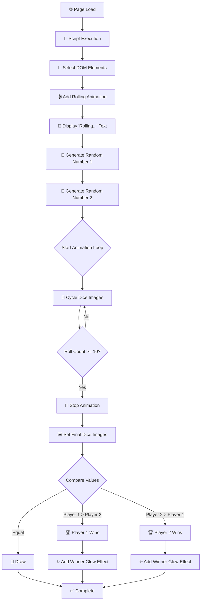
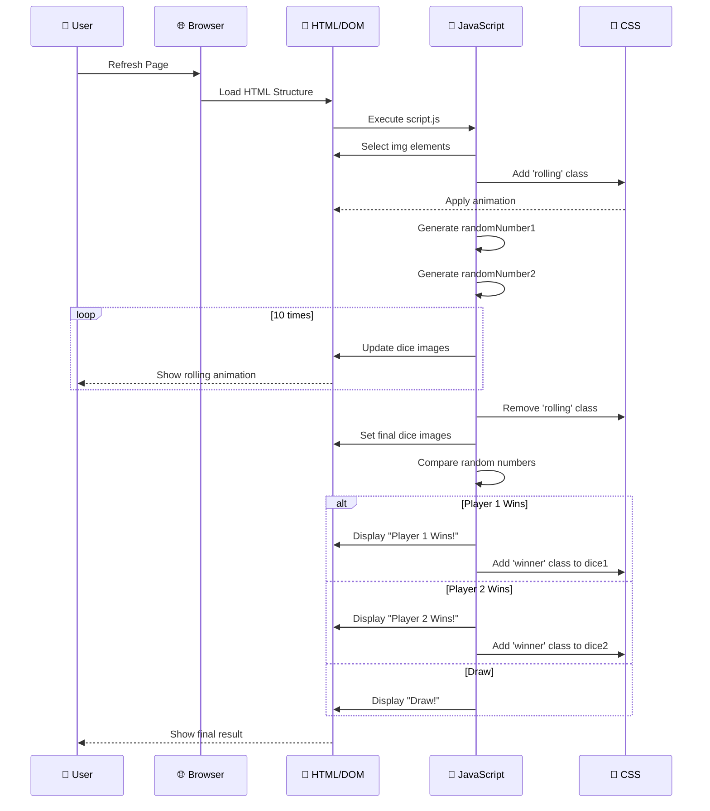
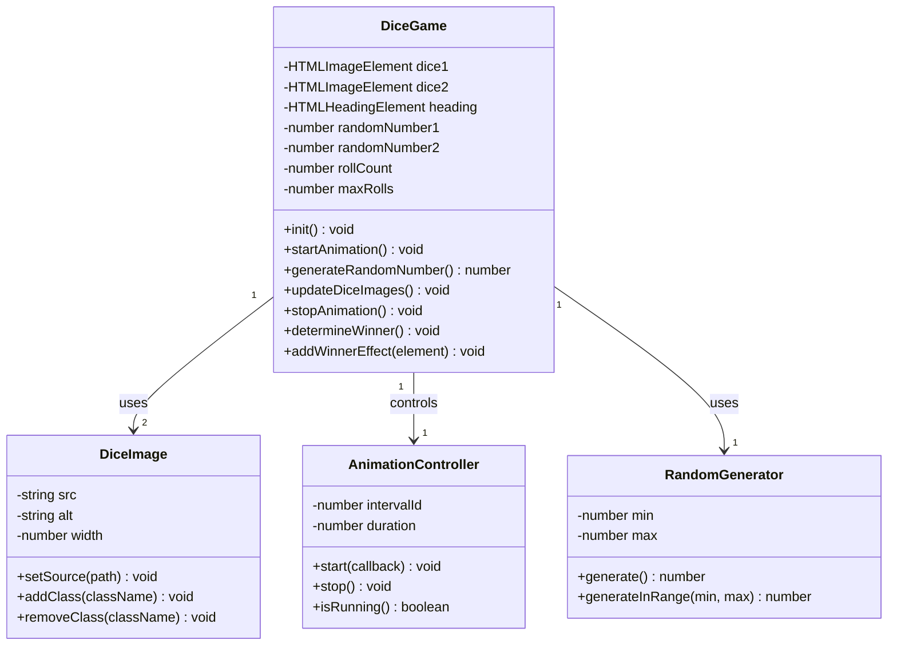
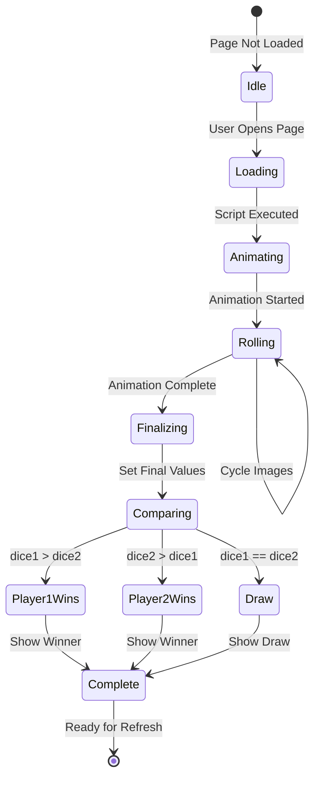
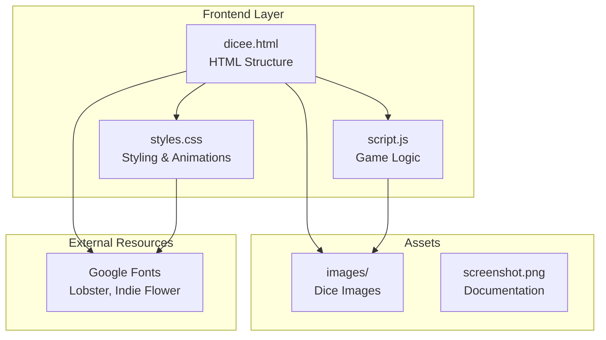
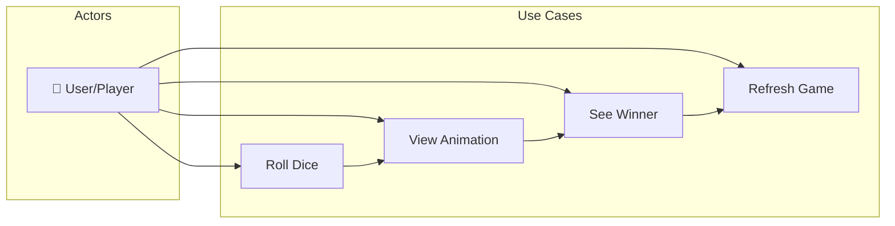

<div align="center">
  
  
  
  # 🎲 Dice Game
  
  ### *A Dynamic Two-Player Dice Game Built with Vanilla JavaScript*
  
  <p>
    
    
    
    
    
  </p>
  
  <p>
    <a href="#-demo"><strong>View Demo</strong></a> • 
    <a href="#-installation"><strong>Installation</strong></a> • 
    <a href="#-documentation"><strong>Documentation</strong></a> • 
    <a href="#-uml-diagrams"><strong>UML Diagrams</strong></a>
  </p>
  
  <br>
  
  
  
</div>

---

## 📋 Table of Contents

| # | Section | Description |
|:---:|---------|-------------|
| 01 | [🎯 Overview](#-overview) | Project introduction and goals |
| 02 | [✨ Features](#-features) | List of implemented features |
| 03 | [🎥 Demo](#-demo) | Screenshots and game preview |
| 04 | [🚀 Installation](#-installation) | Setup and installation guide |
| 05 | [📁 Project Structure](#-project-structure) | File organization |
| 06 | [📐 Architecture](#-architecture) | System architecture overview |
| 07 | [📊 UML Diagrams](#-uml-diagrams) | Flowchart, Sequence, Class diagrams |
| 08 | [💡 JavaScript Concepts](#-javascript-concepts) | Learning resources |
| 09 | [🔧 API Reference](#-api-reference) | Code documentation |
| 10 | [🛠️ Technologies](#-technologies) | Tech stack used |
| 11 | [👤 Author](#-author) | Contact information |

---

## 🎯 Overview

### Project Description

**Dice Game** is an interactive web application that simulates a classic dice-rolling game between two players. The application demonstrates fundamental web development concepts including DOM manipulation, event handling, CSS animations, and algorithmic logic.

### Project Goals

| Goal | Description | Status |
|:----:|-------------|:------:|
| 🎲 | Implement random dice generation | ✅ |
| 🎬 | Add rolling animation effects | ✅ |
| 🏆 | Determine winner automatically | ✅ |
| 🎨 | Create modern, responsive UI | ✅ |
| 📱 | Ensure cross-device compatibility | ✅ |

### Key Highlights

```
┌─────────────────────────────────────────────────────────────────┐
│                        🎲 DICE GAME                              │
├─────────────────────────────────────────────────────────────────┤
│  ✅ Pure Vanilla JavaScript (No frameworks required)            │
│  ✅ CSS3 Animations with keyframes                              │
│  ✅ Responsive Design (Mobile-first approach)                   │
│  ✅ Clean Code Architecture                                     │
│  ✅ Educational Documentation                                   │
└─────────────────────────────────────────────────────────────────┘
```

---

## ✨ Features

### Core Features

<div align="center">

| Feature | Description | Implementation |
|:-------:|-------------|----------------|
| 🎲 **Random Dice Roll** | Generates random values (1-6) using `Math.random()` | `Math.floor(Math.random() * 6) + 1` |
| 🎬 **Rolling Animation** | Smooth CSS animation with rotation and bounce | `@keyframes roll`, `@keyframes bounce` |
| 🏆 **Winner Detection** | Compares dice values and declares winner | `if/else if/else` conditional logic |
| ✨ **Winner Glow Effect** | Green glow animation on winning dice | `@keyframes winner-glow` |
| 🎨 **Modern UI** | Dark theme with custom Google Fonts | Lobster, Indie Flower |
| 📱 **Responsive** | Adapts to all screen sizes | CSS Flexbox, percentage widths |

</div>

### Feature Details

<details>
<summary>🎲 <strong>Random Dice Roll</strong></summary>

The dice roll feature uses JavaScript's built-in `Math` object to generate random numbers:

```javascript
// Generate random number between 1 and 6
var randomNumber = Math.floor(Math.random() * 6) + 1;

// Math.random()  → 0.0 to 0.999...
// * 6             → 0.0 to 5.999...
// Math.floor()    → 0 to 5
// + 1             → 1 to 6 ✅
```

</details>

<details>
<summary>🎬 <strong>Rolling Animation</strong></summary>

The animation combines two CSS keyframe animations:

```css
@keyframes roll {
  0%   { transform: rotate(0deg) scale(1); }
  25%  { transform: rotate(90deg) scale(1.1); }
  50%  { transform: rotate(180deg) scale(1); }
  75%  { transform: rotate(270deg) scale(1.1); }
  100% { transform: rotate(360deg) scale(1); }
}

@keyframes bounce {
  0%, 100% { transform: translateY(0); }
  50%      { transform: translateY(-20px); }
}
```

</details>

<details>
<summary>🏆 <strong>Winner Detection Algorithm</strong></summary>

```javascript
if (randomNumber1 > randomNumber2) {
    // Player 1 wins
    heading.innerHTML = "🚩 Player 1 Wins!";
    dice1.classList.add("winner");
} else if (randomNumber2 > randomNumber1) {
    // Player 2 wins
    heading.innerHTML = "Player 2 Wins! 🚩";
    dice2.classList.add("winner");
} else {
    // Draw
    heading.innerHTML = "🤝 Draw!";
}
```

</details>

---

## 🎥 Demo

### Game Preview

<div align="center">

| Scenario | Player 1 | Player 2 | Result |
|:--------:|:--------:|:--------:|:------:|
| Win | 🎲 `5` | 🎲 `3` | 🏆 **Player 1 Wins!** |
| Win | 🎲 `2` | 🎲 `6` | 🏆 **Player 2 Wins!** |
| Draw | 🎲 `4` | 🎲 `4` | 🤝 **Draw!** |

</div>

### Screenshot

<div align="center">
  
  
  *The dice game interface showing the game in action*
</div>

### Game Flow Animation

```
┌──────────────┐     ┌──────────────┐     ┌──────────────┐
│   Page Load  │ ──▶ │   Rolling    │ ──▶ │   Result     │
│              │     │   Animation  │     │   Display    │
└──────────────┘     └──────────────┘     └──────────────┘
       │                    │                    │
       ▼                    ▼                    ▼
  ┌─────────┐         ┌─────────┐         ┌─────────┐
  │ Start   │         │ Random  │         │ Winner  │
  │ Script  │         │ Images  │         │ Glow    │
  └─────────┘         └─────────┘         └─────────┘
```

---

## 🚀 Installation

### Prerequisites

| Requirement | Version | Purpose |
|-------------|:-------:|---------|
| Web Browser | Modern* | Run the application |
| Text Editor | Any | View/edit code (optional) |
| Git | Latest | Clone repository (optional) |

> *Chrome, Firefox, Safari, Edge (latest versions)

### Quick Start

```bash
# ═══════════════════════════════════════════════════════════
# 📥 METHOD 1: Clone with Git
# ═══════════════════════════════════════════════════════════

git clone https://github.com/Lagmouchyoussef/dice-game.git
cd dice-game

# ═══════════════════════════════════════════════════════════
# 📥 METHOD 2: Download ZIP
# ═══════════════════════════════════════════════════════════

# 1. Go to https://github.com/Lagmouchyoussef/dice-game
# 2. Click "Code" → "Download ZIP"
# 3. Extract the ZIP file
# 4. Navigate to the extracted folder
```

### Running the Application

```bash
# ═══════════════════════════════════════════════════════════
# 🌐 Open in Browser
# ═══════════════════════════════════════════════════════════

# Windows
start dicee.html

# macOS
open dicee.html

# Linux
xdg-open dicee.html

# Or simply double-click dicee.html file
```

### VS Code Live Server

```
1. Install "Live Server" extension in VS Code
2. Open the project folder
3. Right-click on dicee.html
4. Select "Open with Live Server"
5. Browser opens automatically at http://127.0.0.1:5500
```

---

## 📁 Project Structure

### Directory Tree

```
🎲 dice-game/
│
├── 📄 dicee.html              # Main HTML document
│   └── Contains: Page structure, dice containers, script link
│
├── 📄 styles.css              # Stylesheet with animations
│   └── Contains: Layout styles, keyframe animations, responsive design
│
├── 📄 script.js               # JavaScript game logic
│   └── Contains: Random generation, DOM manipulation, animation control
│
├── 📄 README.md               # Project documentation
│   └── Contains: Setup guide, UML diagrams, code documentation
│
├── 🖼️ screenshot.png          # Game screenshot
│   └── Purpose: Documentation and preview
│
└── 📁 images/                 # Dice image assets
    ├── 🖼️ dice1.png           # Dice face showing 1 dot
    ├── 🖼️ dice2.png           # Dice face showing 2 dots
    ├── 🖼️ dice3.png           # Dice face showing 3 dots
    ├── 🖼️ dice4.png           # Dice face showing 4 dots
    ├── 🖼️ dice5.png           # Dice face showing 5 dots
    └── 🖼️ dice6.png           # Dice face showing 6 dots
```

### File Descriptions

| File | Size | Lines | Purpose |
|------|:----:|:-----:|---------|
| `dicee.html` | ~1KB | 31 | HTML structure and layout |
| `styles.css` | ~2KB | 66 | Styling and CSS animations |
| `script.js` | ~2KB | 52 | Game logic and interactivity |
| `README.md` | ~15KB | 500+ | Documentation and diagrams |

---

## 📐 Architecture

### System Architecture

```
┌─────────────────────────────────────────────────────────────────────────┐
│                           DICE GAME ARCHITECTURE                         │
├─────────────────────────────────────────────────────────────────────────┤
│                                                                          │
│  ┌─────────────┐    ┌─────────────┐    ┌─────────────┐                 │
│  │   PRESENTATION LAYER (HTML/CSS)   │                                  │
│  ├─────────────┤    ├─────────────┤    ├─────────────┤                 │
│  │  dicee.html │◄──▶│  styles.css │    │   Images    │                 │
│  │  (Structure)│    │ (Styling)   │    │  (Assets)   │                 │
│  └──────┬──────┘    └─────────────┘    └─────────────┘                 │
│         │                                                                │
│         │ DOM Manipulation                                               │
│         ▼                                                                │
│  ┌─────────────────────────────────────────────────────────────────┐   │
│  │                    LOGIC LAYER (JavaScript)                       │   │
│  ├─────────────────────────────────────────────────────────────────┤   │
│  │                          script.js                                │   │
│  │  ┌─────────────┐  ┌─────────────┐  ┌─────────────┐              │   │
│  │  │   Random    │  │    DOM      │  │  Animation  │              │   │
│  │  │ Generation  │  │ Manipulation│  │   Control   │              │   │
│  │  └─────────────┘  └─────────────┘  └─────────────┘              │   │
│  └─────────────────────────────────────────────────────────────────┘   │
│                                                                          │
└─────────────────────────────────────────────────────────────────────────┘
```

### Component Interaction

```
┌──────────────┐      ┌──────────────┐      ┌──────────────┐
│   Browser    │      │   HTML Page  │      │   JavaScript │
│   (Client)   │      │   (DOM)      │      │   (Logic)    │
└──────┬───────┘      └──────┬───────┘      └──────┬───────┘
       │                     │                     │
       │  1. Load Page       │                     │
       │────────────────────▶│                     │
       │                     │                     │
       │                     │  2. Execute Script  │
       │                     │────────────────────▶│
       │                     │                     │
       │                     │  3. Generate Random │
       │                     │◀────────────────────│
       │                     │                     │
       │                     │  4. Update DOM      │
       │                     │◀────────────────────│
       │                     │                     │
       │  5. Display Result  │                     │
       │◀────────────────────│                     │
       │                     │                     │
```

---

## 📊 UML Diagrams

### 1. Activity Diagram (Flowchart)



### 2. Sequence Diagram



### 3. Class Diagram



### 4. State Diagram



### 5. Component Diagram



### 6. Use Case Diagram



---

## 💡 JavaScript Concepts

### Core Concepts Demonstrated

| # | Concept | Implementation | Code Example |
|:-:|---------|----------------|--------------|
| 1 | Random Number Generation | `Math.random()`, `Math.floor()` | `Math.floor(Math.random() * 6) + 1` |
| 2 | DOM Selection | `querySelectorAll()`, `querySelector()` | `document.querySelectorAll('img')[0]` |
| 3 | DOM Manipulation | `setAttribute()`, `innerHTML` | `dice1.setAttribute("src", path)` |
| 4 | CSS Class Manipulation | `classList.add()`, `classList.remove()` | `dice1.classList.add("rolling")` |
| 5 | Timing Functions | `setInterval()`, `clearInterval()` | `setInterval(callback, 100)` |
| 6 | Conditional Logic | `if/else if/else` | Winner determination |
| 7 | String Concatenation | Dynamic path construction | `"images/dice" + num + ".png"` |

### Detailed Q&A

<details>
<summary><strong>❓ Q1: How does Math.random() work?</strong></summary>

```javascript
// Math.random() returns a floating-point number between 0 (inclusive) and 1 (exclusive)
Math.random()  // → 0.123456789
Math.random()  // → 0.987654321
Math.random()  // → 0.555555555

// To get a random integer between 1 and 6:
var dice = Math.floor(Math.random() * 6) + 1;

// Step-by-step breakdown:
// 1. Math.random()     → 0.0 to 0.999...
// 2. * 6               → 0.0 to 5.999...
// 3. Math.floor()      → 0, 1, 2, 3, 4, or 5
// 4. + 1               → 1, 2, 3, 4, 5, or 6 ✅
```

</details>

<details>
<summary><strong>❓ Q2: How do querySelector and querySelectorAll differ?</strong></summary>

```javascript
// querySelector - Returns the FIRST matching element
var firstImg = document.querySelector('img');
var heading = document.querySelector('h1');

// querySelectorAll - Returns a NodeList of ALL matching elements
var allImgs = document.querySelectorAll('img');  // NodeList(2) [img.img1, img.img2]

// Access elements by index
var dice1 = allImgs[0];  // First image
var dice2 = allImgs[1];  // Second image

// Iterate through NodeList
allImgs.forEach(function(img) {
    console.log(img.src);
});
```

</details>

<details>
<summary><strong>❓ Q3: How does setInterval work for animations?</strong></summary>

```javascript
// setInterval executes a function repeatedly at specified intervals
var count = 0;

var intervalId = setInterval(function() {
    console.log("Tick: " + count);
    count++;
    
    if (count >= 10) {
        clearInterval(intervalId);  // Stop the interval
        console.log("Animation complete!");
    }
}, 100);  // Execute every 100ms

// Output:
// Tick: 0  (after 100ms)
// Tick: 1  (after 200ms)
// ...
// Tick: 9  (after 1000ms)
// Animation complete!
```

</details>

<details>
<summary><strong>❓ Q4: What is the difference between var, let, and const?</strong></summary>

```javascript
// ═══════════════════════════════════════════════════════════
// var - Function-scoped, can be redeclared and updated
// ═══════════════════════════════════════════════════════════
var x = 1;
var x = 2;  // ✅ Allowed (redeclaration)
x = 3;      // ✅ Allowed (reassignment)

// ═══════════════════════════════════════════════════════════
// let - Block-scoped, can be updated but not redeclared
// ═══════════════════════════════════════════════════════════
let y = 1;
// let y = 2;  // ❌ Error (cannot redeclare)
y = 3;        // ✅ Allowed (reassignment)

// ═══════════════════════════════════════════════════════════
// const - Block-scoped, cannot be updated or redeclared
// ═══════════════════════════════════════════════════════════
const z = 1;
// z = 2;  // ❌ Error (cannot reassign)

// ═══════════════════════════════════════════════════════════
// Scope Example
// ═══════════════════════════════════════════════════════════
if (true) {
    var varVariable = "I'm var";    // Function-scoped
    let letVariable = "I'm let";    // Block-scoped
    const constVariable = "I'm const"; // Block-scoped
}

console.log(varVariable);    // ✅ "I'm var"
// console.log(letVariable); // ❌ ReferenceError
// console.log(constVariable); // ❌ ReferenceError
```

</details>

---

## 🔧 API Reference

### Functions

#### `generateRandomNumber()`

Generates a random integer between 1 and 6.

```javascript
/**
 * Generates a random dice value (1-6)
 * @returns {number} Random integer between 1 and 6
 */
function generateRandomNumber() {
    return Math.floor(Math.random() * 6) + 1;
}
```

| Parameter | Type | Description |
|-----------|------|-------------|
| None | - | - |

| Returns | Type | Description |
|---------|------|-------------|
| Random number | `number` | Integer between 1 and 6 |

---

#### `updateDiceImage(diceElement, value)`

Updates the dice image source based on the value.

```javascript
/**
 * Updates the dice image
 * @param {HTMLImageElement} diceElement - The img element to update
 * @param {number} value - The dice value (1-6)
 */
function updateDiceImage(diceElement, value) {
    diceElement.setAttribute("src", "images/dice" + value + ".png");
}
```

---

#### `determineWinner(value1, value2)`

Compares two dice values and returns the winner.

```javascript
/**
 * Determines the winner based on dice values
 * @param {number} value1 - Player 1's dice value
 * @param {number} value2 - Player 2's dice value
 * @returns {string} Winner message
 */
function determineWinner(value1, value2) {
    if (value1 > value2) return "Player 1 Wins!";
    if (value2 > value1) return "Player 2 Wins!";
    return "Draw!";
}
```

---

## 🛠️ Technologies

### Tech Stack

<div align="center">

| Technology | Version | Purpose | Documentation |
|:----------:|:-------:|---------|---------------|
|  | HTML5 | Page structure & semantic markup | [MDN HTML](https://developer.mozilla.org/en-US/docs/Web/HTML) |
|  | CSS3 | Styling, layout & animations | [MDN CSS](https://developer.mozilla.org/en-US/docs/Web/CSS) |
|  | ES6+ | Game logic & interactivity | [MDN JS](https://developer.mozilla.org/en-US/docs/Web/JavaScript) |
| 🔤 | Google Fonts | Custom typography | [Google Fonts](https://fonts.google.com/) |

</div>

### Browser Support

| Browser | Version | Support |
|---------|:-------:|:-------:|
| Chrome | 80+ | ✅ Full |
| Firefox | 75+ | ✅ Full |
| Safari | 13+ | ✅ Full |
| Edge | 80+ | ✅ Full |
| Opera | 67+ | ✅ Full |

---

## 👤 Author

<div align="center">

### **Youssef Lagmouch**


[](https://github.com/Lagmouchyoussef)

---

### 📄 License

This project is licensed under the **MIT License** - see the [LICENSE](LICENSE) file for details.

---

### ⭐ Show Your Support

If you found this project helpful or interesting, please consider:

⭐ **Starring** this repository

🍴 **Forking** to contribute

📢 **Sharing** with others

---

**Made with ❤️ and ☕ by [Youssef Lagmouch](https://github.com/Lagmouchyoussef)**

</div>
