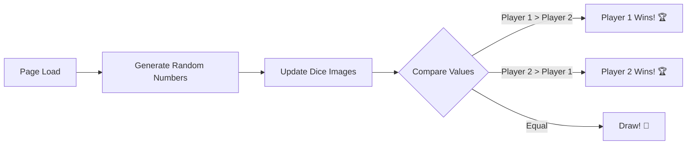

<div align="center">

# 🎲 Dice Game

### *A Dynamic Two-Player Dice Game Built with Vanilla JavaScript*


---

<!-- Badges -->


---

### 🎮 **[Live Demo](https://lagmouchyoussef.github.io/dice-game/)** | 📂 **[Repository](https://github.com/Lagmouchyoussef/dice-game)**

---

</div>

<br>

## 📖 Table of Contents

| Icon | Section |
|:----:|---------|
| 🎯 | [Overview](#-overview) |
| ✨ | [Features](#-features) |
| 🎥 | [Demo](#-demo) |
| 🚀 | [Installation](#-installation) |
| 📁 | [Project Structure](#-project-structure) |
| 💡 | [JavaScript Concepts](#-javascript-concepts--questions) |
| 🔧 | [Code Explanation](#-code-explanation) |
| 🛠️ | [Technologies](#-technologies) |
| 👤 | [Author](#-author) |

<br>

---

## 🎯 Overview

> **Dice Game** is an interactive web application that simulates a classic dice-rolling game between two players. Each page refresh generates random dice values, and the game automatically determines the winner based on the results.

<br>

<div align="center">

### 🎲 Game Flow



</div>

<br>

---

## ✨ Features

<div align="center">

| Feature | Description | Status |
|---------|-------------|:------:|
| 🎲 **Random Dice Roll** | Generates random values (1-6) for each player | ✅ |
| 👥 **Two-Player Mode** | Player 1 vs Player 2 gameplay | ✅ |
| 🏆 **Auto Winner Declaration** | Automatically displays the winner | ✅ |
| 🎨 **Modern UI Design** | Clean and responsive interface | ✅ |
| 🔤 **Custom Typography** | Google Fonts integration | ✅ |
| 📱 **Responsive Layout** | Works on all screen sizes | ✅ |

</div>

<br>

---

## 🎥 Demo

<div align="center">

### 🎬 Game Preview

| 🎲 Player 1 | 🎲 Player 2 | 📢 Result |
|:-----------:|:-----------:|:---------:|
| `5` | `3` | 🏆 **Player 1 Wins!** |
| `2` | `6` | 🏆 **Player 2 Wins!** |
| `4` | `4` | 🤝 **Draw!** |

<br>

### 🖼️ Screenshots

<div align="center">
  


<br>
<br>

*🎯 The dice game interface showing Player 1 as the winner*

</div>

</div>

<br>

---

## 🚀 Installation

### 📥 Quick Start

```bash
# 1️⃣ Clone the repository
git clone https://github.com/Lagmouchyoussef/dice-game.git

# 2️⃣ Navigate to project directory
cd dice-game

# 3️⃣ Open in browser
# Simply double-click dicee.html or use:
open dicee.html        # macOS
start dicee.html       # Windows
xdg-open dicee.html    # Linux
```

### 🌐 Using VS Code Live Server

1. Install the **Live Server** extension in VS Code
2. Right-click on `dicee.html`
3. Select **"Open with Live Server"**

<br>

---

## 📁 Project Structure

<div align="center">

```
🎲 dice-game/
│
├── 📄 dicee.html          ─── Main HTML document
│
├── 📄 styles.css          ─── Stylesheet with custom design
│
├── 📄 script.js           ─── JavaScript game logic
│
├── 📄 README.md           ─── Project documentation
│
└── 📁 images/
    │
    ├── 🖼️ dice1.png       ─── Dice face showing 1
    ├── 🖼️ dice2.png       ─── Dice face showing 2
    ├── 🖼️ dice3.png       ─── Dice face showing 3
    ├── 🖼️ dice4.png       ─── Dice face showing 4
    ├── 🖼️ dice5.png       ─── Dice face showing 5
    └── 🖼️ dice6.png       ─── Dice face showing 6
```

</div>

<br>

---

## 💡 JavaScript Concepts & Questions

> 📚 This section covers fundamental JavaScript concepts demonstrated in this project.

<br>

### ❓ Question 1: How do we generate a random number between 1 and 6?

<table>
<tr>
<td>

```javascript
var randomNumber1 = Math.floor(Math.random() * 6) + 1;
```

</td>
</tr>
<tr>
<td>

#### 📝 Explanation:

| Step | Code | Result |
|:----:|------|--------|
| 1️⃣ | `Math.random()` | Returns decimal between `0` and `0.999...` |
| 2️⃣ | `Math.random() * 6` | Returns decimal between `0` and `5.999...` |
| 3️⃣ | `Math.floor(...)` | Returns integer between `0` and `5` |
| 4️⃣ | `... + 1` | Returns integer between `1` and `6` ✅ |

</td>
</tr>
</table>

<br>

### ❓ Question 2: How do we select and manipulate DOM elements?

<table>
<tr>
<td>

```javascript
// Method 1: querySelectorAll - selects all matching elements
document.querySelectorAll('img')[0].setAttribute("src", randomImageSource);

// Method 2: querySelector - selects the first matching element
document.querySelector("h1").innerHTML = "Player 1 Wins";
```

</td>
</tr>
<tr>
<td>

#### 📝 Explanation:

| Method | Purpose | Returns |
|--------|---------|---------|
| `querySelectorAll('img')` | Selects all `` elements | NodeList |
| `[0]` or `[1]` | Accesses specific element by index | Element |
| `setAttribute("src", value)` | Changes the `src` attribute | `undefined` |
| `innerHTML` | Gets/sets HTML content inside element | String |

</td>
</tr>
</table>

<br>

### ❓ Question 3: How do we construct dynamic file paths?

<table>
<tr>
<td>

```javascript
var randomImageSource = "images/dice" + randomNumber1 + ".png";
```

</td>
</tr>
<tr>
<td>

#### 📝 Explanation:

```
"images/dice"  +  randomNumber1  +  ".png"
     ↓                 ↓              ↓
   String    +    Number(3)    +   String
     ↓                 ↓              ↓
"images/dice"  +     "3"       +  ".png"
     ↓
"images/dice3.png"  ✅
```

</td>
</tr>
</table>

<br>

### ❓ Question 4: How do we use conditional statements to determine the winner?

<table>
<tr>
<td>

```javascript
if (randomNumber1 > randomNumber2) {
    document.querySelector("h1").innerHTML = "Player 1 Wins";
} else if (randomNumber2 > randomNumber1) {
    document.querySelector("h1").innerHTML = "Player 2 Wins";
} else {
    document.querySelector("h1").innerHTML = "Draw";
}
```

</td>
</tr>
<tr>
<td>

#### 📝 Explanation:

```
        ┌─────────────────────┐
        │   Compare Values    │
        └──────────┬──────────┘
                   │
        ┌──────────┴──────────┐
        ▼                     ▼
   Player 1 > Player 2?   Player 2 > Player 1?
        │                     │
        ▼                     ▼
   "Player 1 Wins"      "Player 2 Wins"
        │                     │
        └──────────┬──────────┘
                   │
                   ▼ (if neither)
              "Draw"
```

</td>
</tr>
</table>

<br>

### ❓ Question 5: Why is the script placed at the end of the body tag?

<table>
<tr>
<td>

```html
<body>
    <!-- HTML content loads first -->
    <div class="container">...</div>
    
    <!-- Script runs after DOM is ready -->
    <script src="script.js"></script>
</body>
```

</td>
</tr>
<tr>
<td>

#### 📝 Explanation:

| Placement | Behavior | Recommendation |
|-----------|----------|----------------|
| In `<head>` | Script runs before DOM loads ❌ | Avoid without `defer` |
| End of `<body>` | Script runs after DOM loads ✅ | **Recommended** |
| With `defer` attribute | Script runs after HTML parsing ✅ | Modern approach |

</td>
</tr>
</table>

<br>

### ❓ Question 6: What is the difference between `var`, `let`, and `const`?

<table>
<tr>
<td>

```javascript
// var - function-scoped, can be redeclared (older syntax)
var randomNumber1 = Math.floor(Math.random() * 6) + 1;

// let - block-scoped, can be reassigned (modern syntax)
let randomNumber2 = Math.floor(Math.random() * 6) + 1;

// const - block-scoped, cannot be reassigned
const maxDiceValue = 6;
```

</td>
</tr>
<tr>
<td>

#### 📝 Explanation:

| Keyword | Scope | Redeclare | Reassign | Hoisted | Use Case |
|---------|-------|:---------:|:--------:|:-------:|----------|
| `var` | Function | ✅ Yes | ✅ Yes | ✅ Yes | Legacy code |
| `let` | Block | ❌ No | ✅ Yes | ❌ No | Variables that change |
| `const` | Block | ❌ No | ❌ No | ❌ No | Constants |

</td>
</tr>
</table>

<br>

---

## 🔧 Code Explanation

### 📜 Full JavaScript Code Breakdown

```javascript
// ═══════════════════════════════════════════════════════════
// 🎲 PLAYER 1 DICE ROLL
// ═══════════════════════════════════════════════════════════

// Step 1: Generate random number (1-6) for Player 1
var randomNumber1 = Math.floor(Math.random() * 6) + 1;

// Step 2: Construct the image file path
var randomImageSource = "images/dice" + randomNumber1 + ".png";

// Step 3: Update Player 1's dice image in the DOM
document.querySelectorAll('img')[0].setAttribute("src", randomImageSource);


// ═══════════════════════════════════════════════════════════
// 🎲 PLAYER 2 DICE ROLL
// ═══════════════════════════════════════════════════════════

// Step 4: Generate random number (1-6) for Player 2
var randomNumber2 = Math.floor(Math.random() * 6) + 1;

// Step 5: Construct the image file path
var randomImageSource2 = "images/dice" + randomNumber2 + ".png";

// Step 6: Update Player 2's dice image in the DOM
document.querySelectorAll('img')[1].setAttribute("src", randomImageSource2);


// ═══════════════════════════════════════════════════════════
// 🏆 DETERMINE THE WINNER
// ═══════════════════════════════════════════════════════════

// Step 7: Compare values and display result
if (randomNumber1 > randomNumber2) {
    document.querySelector("h1").innerHTML = "🚩 Player 1 Wins!";
} else if (randomNumber2 > randomNumber1) {
    document.querySelector("h1").innerHTML = "Player 2 Wins! 🚩";
} else {
    document.querySelector("h1").innerHTML = "🤝 Draw!";
}
```

<br>

---

## 🛠️ Technologies

<div align="center">

| Technology | Icon | Purpose |
|------------|:----:|---------|
| **HTML5** |  | Page structure and semantic markup |
| **CSS3** |  | Styling, layout, and visual design |
| **JavaScript** |  | Game logic and DOM manipulation |
| **Google Fonts** | 🔤 | Custom typography (Lobster, Indie Flower) |

</div>

<br>

---

## 👤 Author

<div align="center">

### 🧑‍💻 **Youssef Lagmouch**


[](https://github.com/Lagmouchyoussef)

</div>

<br>

---

<div align="center">

## 📄 License

This project is open source and available for **educational purposes**.

---

### ⭐ If you found this project helpful, please consider giving it a star! ⭐

---

**Made with ❤️ and ☕**

</div>
